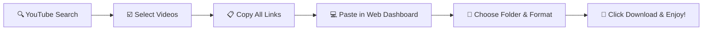

<div align="center">

# ⚡ YouTube Video Bulk Selector & Downloader Pro
### 🚀 The Ultimate Combo: Smart Chrome Extension + High-Speed yt-dlp Local Web Dashboard

<p align="center">
  
  
  
  
  
</p>

<p align="center">
  <b>YouTube ব্রাউজিং থেকে শুরু করে ১-ক্লিকে ১০০+ ভিডিও/অডিও ফুল স্পিডে লোকাল ড্রাইভে ডাউনলোড করার জন্য আমার তৈরি কমপ্লিট ওপেন-সোর্স সল্যুশন! 🔥</b>
</p>

---

[✨ ফিচারের বিবরণ](#-মুখ্য-সুবিধাসমূহ) •
[📥 এক্সটেনশন সেটআপ](#-১-chrome-extension-সেটআপ-গাইড) •
[💻 ডাউনলোডার রান করার নিয়ম](#-২-python-ডাউনলোডার-ড্যাশবোর্ড-চালু-করার-নিয়ম) •
[👨‍💻 আমার সাথে যুক্ত হোন](#-আমার-সাথে-যুক্ত-হোন--কানেক্ট-করুন)

---

</div>

## 💡 কেন আমি এই প্রজেক্টটি তৈরি করলাম?

প্রতিদিন ইউটিউবে কোনো কোর্স, প্লেলিস্ট বা নির্দিষ্ট টপিকের ভিডিও একসাথে ডাউনলোড করতে গেলে বারবার কপি-পেস্ট করা অনেক সময়সাপেক্ষ এবং বিরক্তিকর। তাই আমি নিজেই এমন একটি সিস্টেম ডেভেলপ করেছি যেখানে:
1. ইউটিউবে সার্চ করার পর সরাসরি প্রতিটি ভিডিওর উপরে **সিলেক্ট বাটন** থাকবে।
2. ইচ্ছামতো ভিডিও সিলেক্ট করে **১-ক্লিকে সব লিংক কপি** করা যাবে।
3. আমার তৈরি **লোকাল পাইথন ড্যাশবোর্ডে** লিংকগুলো পেস্ট করে সরাসরি পছন্দের ফোল্ডারে **ভিডিও (MP4 1080p/4K)** অথবা **অডিও (MP3 320kbps)** ফরমেটে লাইভ প্রোগ্রেস সহ ডাউনলোড হবে!

---

## ✨ মুখ্য সুবিধাসমূহ

### 🎯 ১. ক্রোম এক্সটেনশন (YouTube Selector)
- 🔴 **ইন-ভিডিও চেকবক্স**: সার্চ রেজাল্ট, চ্যানেল বা হোমপেজের প্রতিটি ভিডিওর কোণে সুন্দর সিলেক্টর ব্যাজ।
- 📌 **ফ্লোটিং সাইডবার ড্রয়ার**: স্ক্রিনের ডানপাশে ফ্লোটিং প্যানেল যাতে কয়টা ভিডিও সিলেক্ট হলো তা রিয়েল-টাইমে দেখা যায়।
- ⚡ **১-ক্লিকে অল কপি**: এক ক্লিকেই সব সিলেক্ট করা লিংক ক্লিপবোর্ডে কপি।
- 🔄 **Quick Filters**: "Select All Visible" এবং "Clear All" শর্টকাট।

### 🚀 ২. পাইথন yt-dlp ড্যাশবোর্ড (Web UI)
- 🖥️ **মডার্ন গ্লাস-ডার্ক ড্যাশবোর্ড**: স্ক্রিপ্ট রান করলেই অটোমেটিক ক্রোম ব্রাউজারে ড্যাশবোর্ড ওপেন হবে।
- 📂 **লোকাল ফোল্ডার সিলেক্টর**: "Browse" বাটনে ক্লিক করে কম্পিউটারের যেকোনো ড্রাইভ/ফোল্ডার সিলেক্ট করার অপশন।
- 🎬 / 🎵 **মাল্টি-ফরম্যাট সাপোর্ট**:
  - **Video (MP4)**: Best Quality, 1080p Full HD, 720p, 480p।
  - **Audio (MP3)**: হাই কোয়ালিটি 320 kbps অডিও কনভার্সন।
- 📊 **রিয়েল-টাইম প্রোগ্রেস ও স্পিড**: প্রতিটি ভিডিওর জন্য আলাদা ডাউনলোড স্পিড (MB/s), ETA ও প্রোগ্রেস বার।
- ⚡ **বাল্ক ডাউনলোড ক্ষমতা**: একসাথে ১ থেকে ১০০+ ভিডিও নিশ্চিন্তে ব্যাকগ্রাউন্ডে ডাউনলোড।

---

## 🛠️ ফোল্ডার স্ট্রাকচার

```bash
📦 Youtube Video download And select Extanson combo
 ┣ 📂 extension/               # ক্রোম এক্সটেনশন (Manifest V3)
 ┃ ┣ 📜 manifest.json
 ┃ ┣ 📜 content.js             # ইউটিউবে চেকবক্স ও সাইডবার ইনজেকশন
 ┃ ┣ 📜 content.css            # স্টাইলিং ও অ্যানিমেশন
 ┃ ┣ 📜 popup.html & popup.js  # টুলবার পপআপ
 ┃ ┗ 📂 icons/                 # এক্সটেনশন আইকনসমূহ
 ┣ 📂 downloader/              # পাইথন ব্যাকএন্ড ও ড্যাশবোর্ড
 ┃ ┣ 📜 app.py                 # FastAPI & WebSocket সার্ভার
 ┃ ┣ 📜 downloader_core.py     # yt-dlp মাল্টি-থ্রেডেড ইঞ্জিন
 ┃ ┣ 📜 run.py                 # অটো-লঞ্চার স্ক্রিপ্ট
 ┃ ┣ 📜 start.bat              # ডাবল ক্লিকে রান করার ওয়ান-ক্লিক ব্যাচ ফাইল
 ┃ ┣ 📜 requirements.txt       # ডিপেন্ডেন্সিস
 ┃ ┗ 📂 web/                   # রেসপনসিভ ডার্ক থিম ওয়েব UI
 ┗ 📜 README.md                # প্রোজেক্ট ডকুমেন্টেশন
```

---

## 📥 ১. Chrome Extension সেটআপ গাইড

১. গুগল ক্রোম ব্রাউজার ওপেন করুন এবং অ্যাড্রেস বারে যান:
```text
chrome://extensions/
```
২. উপরে ডানপাশের **Developer mode** অপশনটি **ON** করে দিন।  
৩. বামপাশে থাকা **Load unpacked** বাটনে ক্লিক করুন।  
৪. এই রিপোজিটরি থেকে **`extension`** ফোল্ডারটি সিলেক্ট করুন।  
৫. ব্যাস! এক্সটেনশন ইনস্টল হয়ে গেছে। এবার ইউটিউবে গিয়ে ভিডিও সিলেক্ট করা শুরু করুন।

---

## 💻 ২. Python ডাউনলোডার ড্যাশবোর্ড চালু করার নিয়ম

### সহজ পদ্ধতি (Windows User):
- শুধু **`downloader`** ফোল্ডারে থাকা **`start.bat`** ফাইলে ডাবল-ক্লিক করুন!
- এটি প্রয়োজনীয় প্যাকেজগুলো নিজে থেকেই ইনস্টল করে স্বয়ংক্রিয়ভাবে ব্রাউজারে ড্যাশবোর্ড ওপেন করে দেবে।

### টার্মিনাল/ম্যানুয়াল পদ্ধতি:
```bash
# ১. ডাউনলোডার ফোল্ডারে প্রবেশ করুন
cd downloader

# ২. ডিপেন্ডেন্সি ইনস্টল করুন
pip install -r requirements.txt

# ৩. অ্যাপ্লিকেশন রান করুন
python run.py
```
> ব্রাউজারে স্বয়ংক্রিয়ভাবে `http://127.0.0.1:8765` ওপেন হবে।

---

## 🎥 ব্যবহারের পুরো ফ্লো (Step-by-Step)



---

## 👨‍💻 আমার সাথে যুক্ত হোন / সোশ্যাল মিডিয়া

আমি নিয়মিত নতুন নতুন প্রোজেক্ট, অটোমেশন টুলস এবং টেকনোলজি নিয়ে কাজ করি। আমার কাজের আপডেট পেতে এবং যেকোনো সহযোগিতায় আমার সাথে যুক্ত থাকতে পারেন:

<div align="center">

<p align="center">
  <a href="https://youtube.com/@YOUR_CHANNEL" target="_blank">
    
  </a>
  &nbsp;&nbsp;
  <a href="https://facebook.com/YOUR_PAGE" target="_blank">
    
  </a>
  &nbsp;&nbsp;
  <a href="https://github.com/devwithsahadat" target="_blank">
    
  </a>
  &nbsp;&nbsp;
  <a href="mailto:your-email@example.com">
    
  </a>
</p>

<p>
  <i>⭐ এই প্রজেক্টটি যদি আপনার ভালো লেগে থাকে এবং কাজে আসে, তবে গিটহাবে একটি <b>Star</b> দিয়ে পাশে থাকবেন!</i>
</p>

<p>
  <b>Designed & Developed with ❤️ by Sahadat</b>
</p>

</div>
